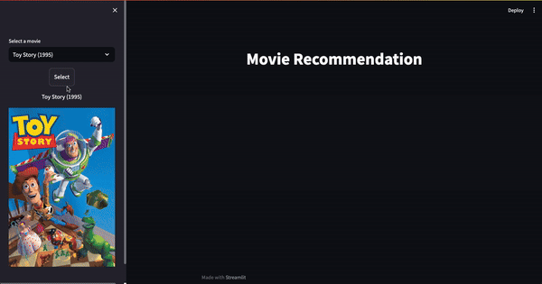

# PopcornPick

PopcornPick is a movie recommendation app that combines content analysis and user preferences to suggest films and shows tailored to your taste. The more you interact with the app, the better its recommendations become!

## Features

- **Content-Based Filtering**: Analyzes movie descriptions, genres, and other metadata to find films similar to those you like.
- **User-Based Filtering**: Provide recommendations based on similarities between users' preferences.
- **Interactive UI**: Built with Streamlit for easy user interaction and visualizations.

## Demo

Here are some snapshots:

### Streamlit Interface


### Movie Recommendations


## Getting Started

### Prerequisites

Ensure you have Python 3.8 or higher installed. You'll also need the following packages, which are listed in the `requirements.txt` file:

### Installation

1. Clone this repository:
   Clone the project repository from GitHub to your local machine using the following command:

   ```bash
   git clone https://github.com/zbrayan404/PopcornPick.git

3. Navigate to the project directory:
   Change the directory to the project folder you just cloned:
   
   ```bash
   cd PopcornPick

5. Run setup script:
   Run the provided setup.sh script to set up the environment, download datasets, and install requirements. Make sure the script has execute permissions, or give it execute permissions using chmod:

   ```bash
   chmod +x setup.sh
   ./setup.sh
   
6. Run the Streamlit app:
   Finally, run the Streamlit app to launch the web interface. This will start a local server and allow you to interact with PopcornPick through your browser:
   
    ```bash
   streamlit run app.py

   
